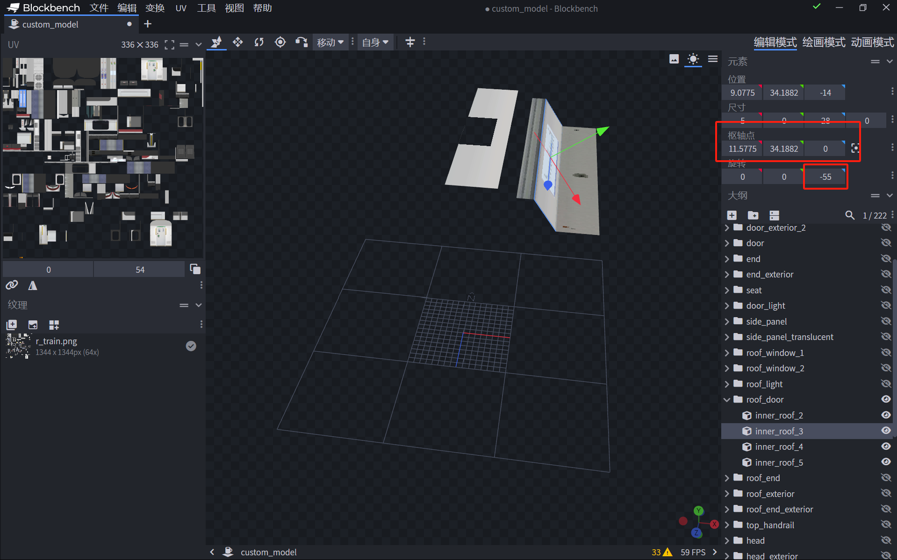

# LCDA

> LCDA 由 Aphrodite281 开发，是一个列车LCD脚本


## 移植

您需要编写一些代码并将此资源包与RailwayAesthetics-Future一起加载。 
您可以下载[示例资源包](https://aphrodite281.github.io/RailwayAesthetics-Future/developer/lcda/example.zip)进行修改。

### 基本信息

您需要在任意命名空间下创建您的js文件作为配置文件: 例如 `assets/mtr/deploying/lcda/qssnn.js`

```javascript
include(Resources.id("mtr:lcda/lcda_main.js"));

with (lcdaConfigs) {
    doorZPositions = [0, 5, -5, 10, -10];
    doorXYPosition = [0.6875, 2.072];
    rotateX = 35 / 180 * Math.PI;
    finalTranslate = [0, 0, -0.012];

    modelSize = [1.2, 0.22];
    textureSize = [modelSize[0] * 2000, modelSize[1] * 2000];
    filletPixel = 50;
    companyNameCJK = "北武工艺";
    companyNameENG = "HOKUBUCRAFT";
    companyLogoPng = Resources.readBufferedImage(Resources.id("your:path/to/your/company_logo.png"));
}

lcdaApply();
```

接下来您需要在 `assets/mtr/mtr_custom_resources.json` 中添加以下内容（根据您的列车类型选择）

```json
    "custom_trains": {
      "lcda_qssnn": {
        "name": "QSSNN (MTR模型)",
        "base_train_type": "s_train",
        "color": "2AF0AD",
        "script_files": ["assets/mtr/deploying/lcda/qssnn.js"]
      },
      "lcda_qssnn_2": {
        "name": "QSSNN (自定义模型)",
        "model": "assets/path/to/your/custom_model.obj",
        "model_properties": "assets/path/to/your/prop.json",
        "texture_id": "minecraft:textures/misc/white.png",
        "script_files": ["assets/mtr/deploying/lcda/qssnn.js"]
      }
    }
```

如果是原版的模型请填写 `base_train_type` 属性，
如果是其他列车模型请将移植列车的属性全部复制过来，添加 `script_files` 属性，值为您的 js 文件路径。(注意有 `[]`)

至此，您便完成了移植。接下来对js中的属性进行介绍：

| 属性 | 说明 | 默认值 |
| --- | --- | --- |
| doorZPositions | 门 Z轴的位置 | [0, 5, -5, 10, -10] |
| doorXYPosition | 门的 XY 位置 | [1.3, 1.9] |
| rotateX | 门的向内偏转角度（弧度制） | 15 / 180 * Math.PI |
| finalTranslate | 最终的偏移，用于精细调整 | [0, 0, 0] |
| modelSize | 模型大小，单位米（块） | [1600 / 2000, 350 / 2000] | [1600 / 2000, 350 / 2000] |
| textureSize | 默认的纹理大小，实际纹理大小会乘以像素密度。 | [1600, 350] |
| filletPixel | 圆角像素 | 30 | 
| companyNameCJK | 公司名称，中文 | "北武工艺" |
| companyNameENG | 公司名称，英文 | "HOKUBUCRAFT" |
| companyLogoPng | 公司Logo，PNG格式 | undefined |

> 以上属性都是可选的，如果您不需要更改，可以不修改。


### 确定参数

#### BBMODEL

对于使用 `bbmodel` 的列车，您需要找到列车的模型文件、下载 `blockbench`，并使用 `blockbench` 打开模型文件。


将坐标系改为全局，在右侧分组中找到 `roof_head` 或类似的分组。


选择位于此位置的块，点击枢轴居中，查看枢轴点位置、旋转信息。

此时的 `-55` 即为此块的旋转角度。  
比如现在应该是 `rotateX = (90 - 55) / 180 * Math.PI`

此时的 `11.5775, 34.1882` 即为此块的 XY 坐标(单位为块)。  
比如现在应该是 `doorXYPosition = [11.5775 / 16, 34.1882 / 16]`  


#### OBJ

对于使用 `obj` 模型的列车，您需要准备好 `obj` 模型查看器(推荐 `Blender`)和移植资源包。
以下以 `Blender 4.0` 为例。


找到列车模型，打开查看器，导入 `obj` 模型。


调整为面模式，找到LCD屏幕所在位置，打开大写锁定，按 `Tab` 切换到顶点模式，选择LCD屏幕所在面，按 `P` 选择分离选中项，按 `Tab` 回到物体模式，选择分离的物体按下 `/` 。


右键物体，将鼠标移动到 `设置原点` ，选择 `原点 -> 几何中心`


查看现在的 `X` 、`Z` 坐标，复制下来作为 `doorXYPosition`  
比如现在应该是 `doorXYPosition = [0.888271, 1.976]`


添加一个尺寸较小的面


打开吸附，选择中心、面并勾选旋转对齐目标。


拖动面至LCD屏幕位置，会自动被吸附，查看此时的 `旋转(Y)` ，复制下来作为 `rotateX`
比如现在应该是 `rotateX = (180 - 136.906) / 180 * Math.PI`


> 最后的最后

如果位置不准确，您可以调整 `finalTranslate` 进行微调。
您可以根据需求设置 模型大小、纹理大小、圆角像素、公司名称、公司Logo等。

至此 您便完成了移植。
使用时请添加 `RailwayAesthetics-Future` (和您移植的列车资源包) 到启用资源包列表中。


### 示例

以为 `LGRS Shenzhen Metro MOVIA456 Train Pack Version1.1` 的 `szmc_01a2206_2011fisu` 添加 `LCDA` 为例：

下载`LGRS Shenzhen Metro MOVIA456 Train Pack Version1.1` 并解压(我解压到 `sz pack` 文件夹)。
下载[示例资源包](https://aphrodite281.github.io/RailwayAesthetics-Future/developer/lcda/example.zip) 并解压(我解压到 `sz del`文件夹)。


找到位于 `./sz pack/assets/mtr/mtr_custom_resources.json` 的json文件，找到您要移植的列车，复制所有内容。


到 `./sz del/assets/mtr/mtr_custom_resources.json` 中替换。


添加或调整以上内容

在 `./sz del/assets/mtr/deploying/lcda/szmc_01a2206_2011fisu.js` 新建 `szmc_01a2206_2011fisu.js`

使用在 [确定参数-OBJ](#obj) 获得的参数填写内容。

```javascript
include(Resources.id("mtr:lcda/lcda_main.js"));

with (lcdaConfigs) {
    doorZPositions = [0, 5, -5, 10, -10];
    doorXYPosition = [0.888271, 1.976];
    rotateX = (90 - (180 - 136.906)) / 180 * Math.PI;
    finalTranslate = [0, 0, 0.001];

    modelSize = [1.35, 0.18];
    textureSize = [modelSize[0] * 2000, modelSize[1] * 2000];
    filletPixel = 50;
    companyNameCJK = "北武工艺";
    companyNameENG = "HOKUBUCRAFT";
    companyLogoPng = undefined;
}

lcdaApply();
```

启动游戏，加载这几个资源包。  
进入世界，测试LCD效果，适当调整参数。


至此 您完成了对 `LGRS Shenzhen Metro MOVIA456 Train Pack Version1.1` 的 `szmc_01a2206_2011fisu` 的 `LCDA` 移植。
您可以下载 [移植包](./sz_pack.zip) 参考。